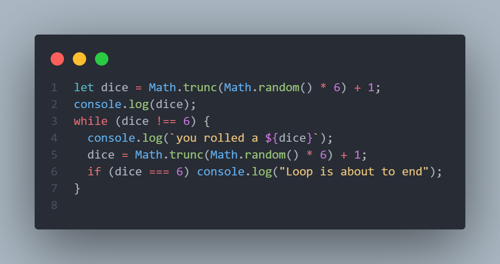

# Lecture 19 while loop



```js
for (let rep = 1; rep <= 10; rep++) {
  console.log(`Lifting weight repetition ${rep}`);
}
let rep = 1;
while (rep <= 10) {
  console.log(`Lifting weight repetition ${rep}`);
  rep++;
```

```js
Lifting weight repetition 1
script.js:482 Lifting weight repetition 2
script.js:482 Lifting weight repetition 3
script.js:482 Lifting weight repetition 4
script.js:482 Lifting weight repetition 5
script.js:482 Lifting weight repetition 6
script.js:482 Lifting weight repetition 7
script.js:482 Lifting weight repetition 8
script.js:482 Lifting weight repetition 9
script.js:482 Lifting weight repetition 10
```

```js
let dice = Math.trunc(Math.random() * 6) + 1;
console.log(dice);
while (dice !== 6) {
  console.log(`you rolled a ${dice}`);
  dice = Math.trunc(Math.random() * 6) + 1;
  if (dice === 6) console.log("Loop is about to end");
}
```

(method) Math.trunc(x: number): number

- Returns the integral part of the a numeric expression, x, removing any fractional digits. If x is already an

-  Math.random(): number

  Returns a pseudorandom number between 0 and 1.
